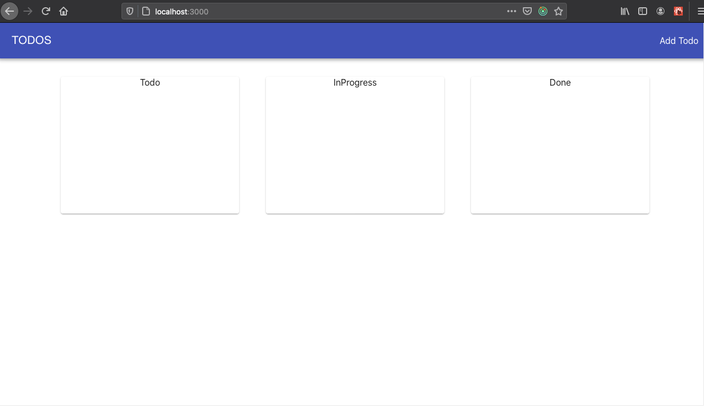
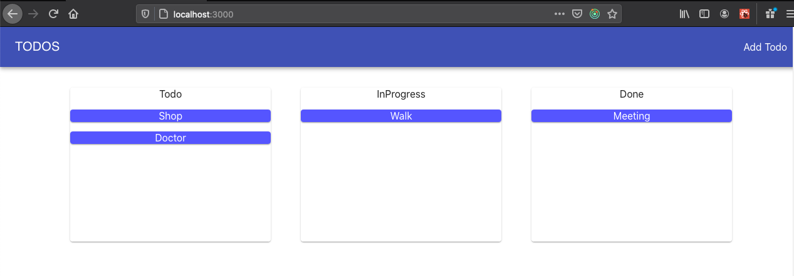
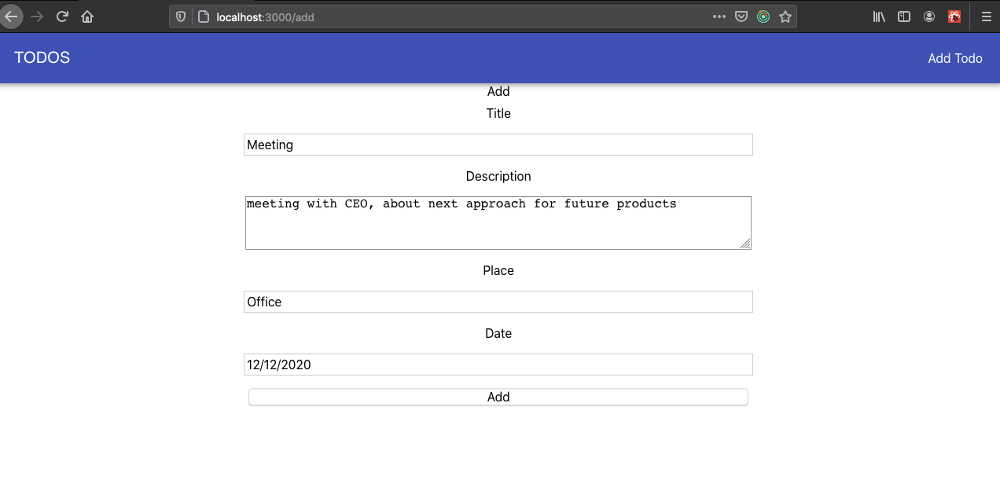
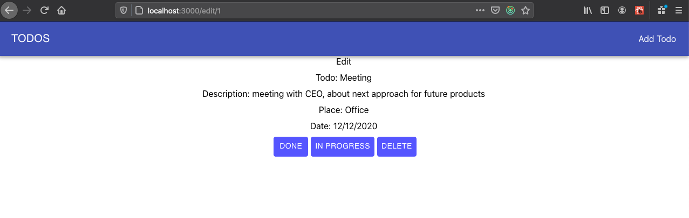

# Henry

## M2 - Checkpoint

## Aclaraciones IMPORTANTES

 * NO pueden utilizar useSelector y useDispatch
 * NO pueden utilizar Class
 * Si utilizan `useState` usenlo de la forma `React.useState` para asegurarse que los tests funcionen correctamente

## Condiciones de aprobación

Para aprobar el checkpoint es necesario contar con un mínimo de 36 tests pasando correctamente sobre los 45 que son obligatorios.

## Completa la Aplicación

En esta aplicacion podremos crear `TODOS`, cambiarle su status, y ver detallado cada uno. Tendremos 3 rutas:

 - **"/"**: La Home, acá vamos a ver nuestros todos.
 - **"/add"**: En esta ruta vamos a poder crear nuestro TODO.
 - **"/edit/{todoId}"**: en esta ruta, vamos a poder editar un todo para cambiarle su status. (extra credit)

Para configurar la aplicacion:

`npm install`

`npm start` (vista en puerto 3000)

`npm test` (para correr los test)

---

## REACT - REDUX

Vas a trabajar en los archivos:

- App.js
- Nav.js
- Home.js
- AddTodo.js
- Todos.js
- Todo.js
- TodoDetail.js
- actions/index.js
- reducer/index.js

## Recomendacion de por donde comenzar y como seguir:

Para el desarrollo de esta aplicacion, te recomendamos seguir este camino:

1. App.js
2. Nav.js
3. Home.js
4. actions/index.js
5. reducer/index.js
6. AddTodo.js
7. Todos.js
8. Todo.js
9. TodoDetail.js

Vas a tener que ir leyendo cada archivo de test por componente y la descripcion de cada uno para ir avanzando.

>Los tests se encuentran comentados. Para poder correrlos tendras que cambiar el `xdescribe()` de cada archivo .test.js por `describe()`.

>Lee bien los tests, y lo que pide, sobre todo los detalles.

---

## Extra Credit (sin tests)

Al hacer click sobre algun TODO en la vista principal, mostrar la ruta `/edit/{todoId}`, en esta ruta se renderizara el componente TodoDetail, ahi se mostrara mas informacion acerca del TODO, como la 'description', 'place' y 'date'.
Tener la posibilidad de cambiarle su `status`. Tendremos 3: 'Todo', 'InProgress' y 'Done'.
Poder elimnar un todo desde el componente TodoDetail.
Las acciones ya las habras creado, ahi tendras que hacer un dispatch segun el status al que quieras cambiara el todo y en la vista principal, veras reflejado el `todo` dentro del componente <Todos /> correspondiente.

---

>Esta aplicacion esta pensada para que pasen los tests, y que tenga la funcionalidad que buscamos, NO tiene estilos por lo que los componentes se veran muy precarios. A modo de guia te mostramos como podría lucir completa:

### Home

 

### Home

 

### AddTodo

 

### TodoDetail

 
